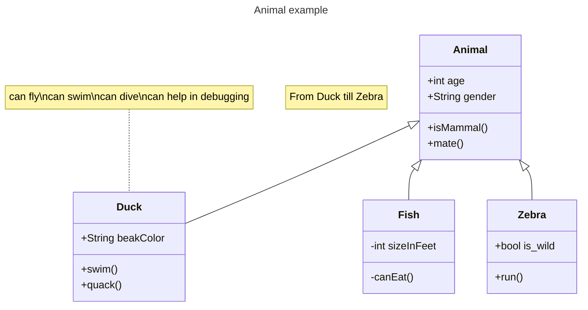

# TowerDefenseTemplate
Dit is een template wat door jullie te gebruiken is voor het juist inleveren van alle producten voor de Towerdefense beroepsopdracht. **Verwijder uiteindelijk de template teksten!**

Begin met een korte omschrijving van je towerdefense game en hoe deze werkt. Plaats ook een paar screenshots.

## Product 1: "DRY SRP Scripts op GitHub"

In dit script heb ik een stukje code waarbij een unit een bepaalde bullet moet schieten met een bepaalde fire rate **(DRY)** in de code zit een counter die checkt of je kan schieten gebaseerd op de gedefineerde fire rate
[link naar script](Assets/Scripts/GameObjects/Unit/UnitShoot.cs)

## Product 2: "Projectmappen op GitHub"

Dit is de [ROOT](/Tower_Defense/?branch=Develop) folder van mijn unity project.

## Product 3: Build op Github

Je maakt in Unity een stabiele “build” van je game waarbij bugs en logs eerst zijn verwijderd. Deze buildfiles upload je in je repository onder releases.  Bij eventuele afwijkingen moeten deze worden gedocumenteerd in de release. (Bijv controller nodig of spelen via netwerk etc..) 

[Release Voorbeeld](https://github.com/erwinhenraat/TowerDefenseTemplate/releases)

## Product 4: Game met Sprites(animations) en Textures 

## Product 5: Issues met debug screenshots op GitHub 

[Hier de link naar mijn issues](D:\Rein\Unity\TowerDefense\Issues)

## Product 6: Game design met onderbouwing 

*  **Je game bevat torens die kunnen mikken en schieten op een bewegend doel.** 

*Mijn units worden op een grid geplaatst waar ze de dichtsbijzijnde enemy vinden en vervolgens daar naartoe draaien,
elke unit neemt een bepaalt stuk grond in in je bouwveld, dus uiteindelijk zul je moeten puzzelen om de beste opstelling te maken*

*  **Je game bevat vernietigbare vijanden die 1 of meerderen paden kunnen volgen.**  

*Mijn enemies bestaan uit infantrie(snel maar zwak) en voertuigen/tanks(langzaam maar sterk)*

*  **Je game bevat een “wave” systeem waarmee er onder bepaalde voorwaarden (tijd/vijanden op) nieuwe waves met vijanden het veld in komen.**

*Mijn game bestaat uit waves, elke wave heeft zijn eigen enemy aantallen en soorten,
je kan nadat de wave over is de volgende wave starten(niet eerder)*

*  **Een “health” systeem waarmee je levens kunt verliezen als vijanden hun doel bereiken en zodoende het spel kunt verliezen.** 

*Onderbouwing hier...*

*  **Een “resource” systeem waarmee je resources kunt verdienen waarmee je torens kunt kopen en .evt upgraden.**

*Mijn Game bevat een geld systeem waarbij je units kan kopen en daarnaast ook je arsenal upgraden om nieuwe units te unlocken*

*  **Een “upgrade” systeem om je torens te verbeteren.**

*Het upgrade systeem is dat je 6 units hebt, 5 hiervan zijn in het begin afgesloten, door het arsenal te upgraden unlock je nieuwe units*

## Product 7: Class Diagram voor volledige codebase 

Je brengt je volledige codebase in kaart met behulp van een class diagram. Binnen de classes hoeven geen private members te worden weergegeven. Wel alle public members (fields en methods). Ook geef je indien relevant de relaties tussen je classes weer. Je class diagram plaats je in je readme op github. Evt mag je dit doen m.b.v de [“Mermaid”](https://mermaid.js.org/syntax/classDiagram.html) tool.

## Product 8: Prototype test video
Je hebt een werkend prototype gemaakt om een idee te testen. Omschrijf if je readme wat het idee van de mechanics is geweest wat je wilde testen en laat een korte video van de gameplay test zien. 

## Product 9: SCRUM planning inschatting 

Je maakt een SCRUM planning en geeft daarbij een inschatting aan elke userstory d.m.v storypoints / zelf te bepalen eenheden. (bijv. Storypoints, Sizes of tijd) aan het begin van een nieuwe sprint update je deze inschatting per userstory. 

Plaats in de readme een link naar je trello en **zorg ervoor dat je deze openbaar maakt**

[Link naar de openbare trello](https://trello.com/b/w60wkKSU/examen-paraphrenia)

## Product 10: Gitflow conventions

Je hebt voor je eigen project in je readme gitflow conventies opgesteld en je hier ook aantoonbaar aan gehouden. 

De gitflow conventions gaan uit van een extra branch Develop naast de "Master"/"Main". Op de main worden alleen stabiele releases gezet.

Verder worden features op een daarvoor bedoelde feature banch ontwikkeld. Ook kun je gebruik maken van een hotfix brancg vanaf develop.

Leg hier uit welke branches jij gaat gebruiken en wat voor namen je hier aan gaat meegeven. Hoe vaak ga je comitten en wat voor commit messages wil je geven?

Meer info over het gebruiken van gitflow [hier](https://www.atlassian.com/git/tutorials/comparing-workflows/gitflow-workflow)

